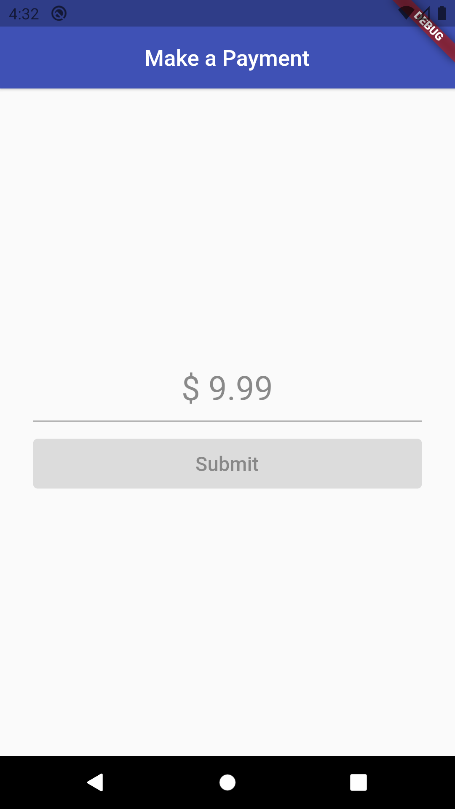
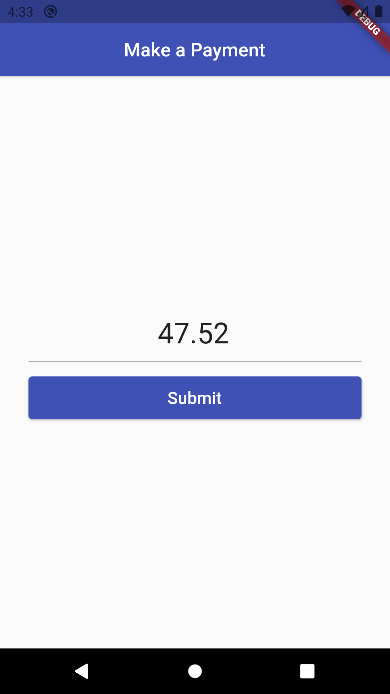
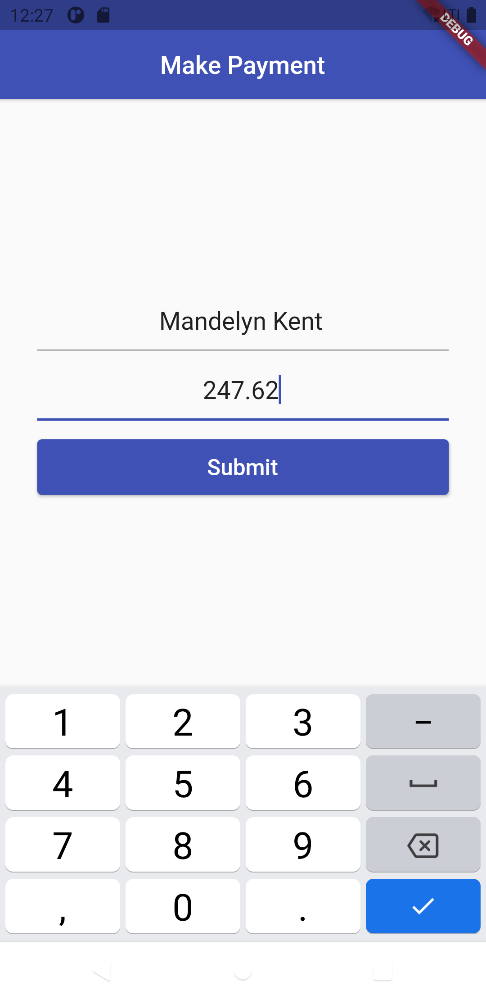
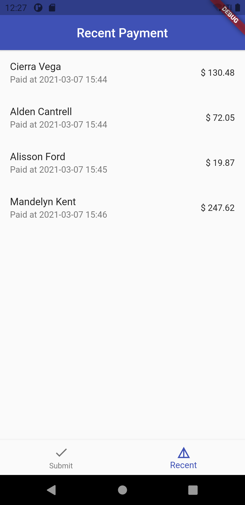

# Flutter Testing demo

This project shows how to implement tests in Flutter

<!-- , using various test methods (unit tests, widget tests, integration tests). -->

## Project goals

This project shows how to:

- implement the various test methods
- use most convinient techniques to write tests
- write production-ready code following best practices

## Preview

<div style="text-align: center"><table><tr>
<td style="text-align: center">

</td>
<td style="text-align: center">

</td>
</td>
<td style="text-align: center">

</td>
</td>
<td style="text-align: center">

</td>
</tr></table>
</div>

## Test features

### Supported test methods

- [x] Unit test (see [documentation](docs/unit-testing.md))
- [x] Widget test (see [documentation](docs/widget-testing.md))
- [x] Integration test (see [documentation](docs/integration-testing.md))

## Application features

### Make payment page

- [x] Regex validation
- [x] Custom `TextInputFormatter` for `TextField`

### Recent payment page

- [x] Shows payment history

## TODO

- [ ] Internationalization
- [ ] Improve documentations

## Project structure

Current project structure:

```
/lib
  /bottom_nav_bar
    /bottom_nav_bar_app
    /bottom_nav_bar_bloc
  /common_widgets
    /string_validator
    /validation_textfield
  /models
    /payment_model
  /payment_notifier
  /make_payment_page
  /recent_payment_page
/test
  /amount_validator_test
  /amount_validator_widget_test
```

This is an arbitrary structure. Choose what works best for **your** project.

## Run the tests

Go to your project terminal and run this command to run all the tests in the project

```console
foo@bar:~$ flutter test
```

## License

```
Copyright (c) 2021 Sandip Pramanik

Permission is hereby granted, free of charge, to any person obtaining a copy
of this software and associated documentation files (the "Software"), to deal
in the Software without restriction, including without limitation the rights
to use, copy, modify, merge, publish, distribute, sublicense, and/or sell
copies of the Software, and to permit persons to whom the Software is
furnished to do so, subject to the following conditions:

The above copyright notice and this permission notice shall be included in all
copies or substantial portions of the Software.

THE SOFTWARE IS PROVIDED "AS IS", WITHOUT WARRANTY OF ANY KIND, EXPRESS OR
IMPLIED, INCLUDING BUT NOT LIMITED TO THE WARRANTIES OF MERCHANTABILITY,
FITNESS FOR A PARTICULAR PURPOSE AND NONINFRINGEMENT. IN NO EVENT SHALL THE
AUTHORS OR COPYRIGHT HOLDERS BE LIABLE FOR ANY CLAIM, DAMAGES OR OTHER
LIABILITY, WHETHER IN AN ACTION OF CONTRACT, TORT OR OTHERWISE, ARISING FROM,
OUT OF OR IN CONNECTION WITH THE SOFTWARE OR THE USE OR OTHER DEALINGS IN THE
SOFTWARE.
```