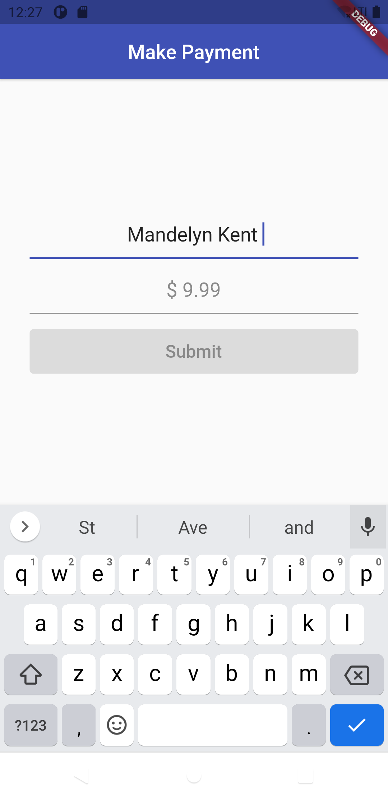

# Flutter Testing demo

This project shows how to implement tests in Flutter using various test methods (unit tests, widget tests, integration tests).

## Project goals

This project shows how to:

- implement the various test methods
- use most convinient techniques to write tests
- write production-ready code following best practices

## Preview

<div style="text-align: center"><table><tr>
<td style="text-align: center">

</td>
<td style="text-align: center">

</td>
</td>
<td style="text-align: center">

</td>
</td>
<td style="text-align: center">

</td>
</tr></table>
</div>

## Test features

### Supported test methods

- [x] Unit test (see [documentation](docs/unit-testing.md))
- [x] Widget test (see [documentation](docs/widget-testing.md))
- [x] Integration test (see [documentation](docs/integration-testing.md))
- [ ] Test with Mockito

## Application features

- [x] Regex validation
- [x] Custom `TextInputFormatter` for `TextField`
- [x] Shows recent payment history
- [x] Save history in Local Storage - [Hive](https://pub.dev/packages/hive)

## TODO

- [ ] Internationalization
- [ ] Improve documentations

## Project structure

Current project structure:

    .
    ├── lib
    ├── test                                           # Test files
    │   ├── amount_validator_test.dart                 # Unit tests
    │   └── amount_validator_widget_test.dart          # Widget tests
    ├── test_driver                                ─┐
    │   ├── app.dart                                │  # Integration tests
    │   └── app_test.dart                          ─┘ 


This is an arbitrary structure. Choose what works best for **your** project.

## Run the tests

Go to your project terminal and run this command to run all the tests in the project

```console
foo@bar:~$ flutter test
```

## License

The project is released under the [MIT License](http://www.opensource.org/licenses/mit-license.php). The license can be found [here](LICENSE).

## Flutter

For help getting started with Flutter, view
[online documentation](https://flutter.dev/docs), which offers tutorials,
samples, guidance on mobile development, and a full API reference.
