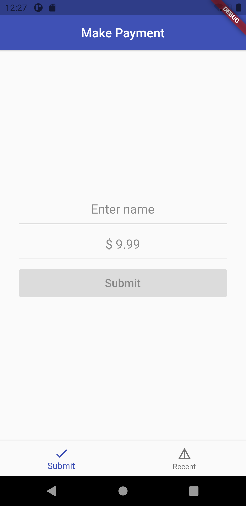

# Flutter Testing demo

This project shows how to implement tests in Flutter 
<!-- , using various test methods (unit tests, widget tests, integration tests). -->

## Project goals

This project shows how to:

- implement the various test methods
- use most convinient techniques to write tests
- write production-ready code following best practices

## Preview

**Unit Test**

<div style="text-align: center"><table><tr>
<td style="text-align: center">

</td>
<td style="text-align: center">

</td>
</tr></table>
</div>

## Test features

### Supported test methods

- [x] Unit test
- [ ] Widget test
- [ ] Integration test

## Application features

### Make payment page

- [x] Regex validation
- [x] Custom `TextInputFormatter` for `TextField`

## TODO

- [ ] Internationalization
- [ ] Improve documentations

## Project structure

Current project structure:

```
/lib
  /home_page
  /string_validator
  /validation_textfield
/test
  /amount_validator_test
```

This is an arbitrary structure. Choose what works best for **your** project.

## Unit Test

We have an abstract class `StringValidator` and a class `RegexValidator` that implements the abstract class.

```dart
abstract class StringValidator {
  bool isValid(String value);
}
```

```dart
class RegexValidator implements StringValidator {
  RegexValidator({@required this.regexSource});
  final String regexSource;

  /// Value is the input string
  /// And this method only returns true when there is a match for regexSource
  @override
  bool isValid(String value) {
    final regex = RegExp(regexSource);
    final matches = regex.allMatches(value);

    /// Check whether the match is applied for the whole length of String(value)
    for (final Match match in matches) {
    if (match.start == 0 && match.end == value.length) {
        return true;
      }
    }
    return false;
  }
}
```

Now it is easy to write tests when we have seperate class for the Business logic components. So the class that we are going to unit test looks like this: 

```dart
class AmountEditingRegexValidator extends RegexValidator {
  AmountEditingRegexValidator()
      : super(regexSource: "^\$|^(0|([1-9][0-9]{0,4}))(\\.[0-9]{0,2})?\$");
}
```

Sample unit test:

```dart
test('Empty amount returns isValid false', () {
  // Arrange (Setup)
  final amountSubmitValidator = AmountSubmitValidator();
  // Act (Run)
  final result = amountSubmitValidator.isValid('');
  // Assert (Verify)
  expect(result, false);
});
```

## Run the tests

Go to your project terminal and run this command to run all the tests in the project

```console
foo@bar:~$ flutter test
```

To run a particular test file use this command

```console
foo@bar:~$ flutter test test/amount_validator_test.dart
```